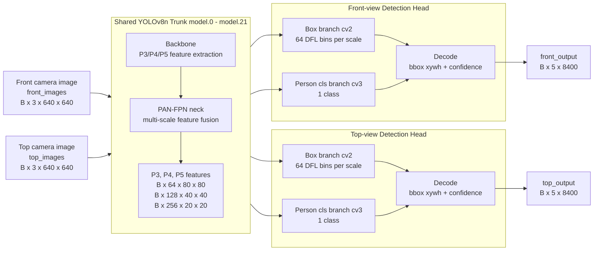

# Dual-Input Shared YOLOv8n Model Architecture

이 문서는 현재 구현된 `dual_yolov8.model.DualYolov8n` 기준의 모델 구조를 정리한다.

## 전체 구조



## 레이어 흐름

| 구간 | YOLO index | 연산 | 출력 의미 |
|---|---:|---|---|
| Stem | 0-1 | `FusedConv` stride 2 x2 | 160x160 기본 feature |
| Backbone P3 | 2-4 | `C2f`, downsample, `C2f` | `P3`: 64ch, 80x80 |
| Backbone P4 | 5-6 | downsample, `C2f` | `P4`: 128ch, 40x40 |
| Backbone P5 | 7-9 | downsample, `C2f`, `SPPF` | `P5`: 256ch, 20x20 |
| Neck up path | 10-15 | upsample + concat + `C2f` | small-object feature `y15` |
| Neck down path | 16-21 | downsample + concat + `C2f` | medium/large features `y18`, `y21` |
| Head split | 22 복제 | `front_head`, `top_head` | view-specific prediction |

Shared trunk의 최종 feature는 다음 3개이다.

| Feature | Shape when input is 640x640 | Stride | 용도 |
|---|---|---:|---|
| `y15` / `p3` | `B x 64 x 80 x 80` | 8 | 작은 객체 |
| `y18` / `p4` | `B x 128 x 40 x 40` | 16 | 중간 객체 |
| `y21` / `p5` | `B x 256 x 20 x 20` | 32 | 큰 객체 |

## Detection Head

각 head는 YOLOv8 Detect head 구조를 유지하되 class 수만 `person` 1개로 줄인다.

```text
P3/P4/P5 feature
   ├─ box branch cv2: FusedConv -> FusedConv -> Conv2d(64)
   └─ cls branch cv3: FusedConv -> FusedConv -> Conv2d(1)

raw per scale: B x 65 x H x W
decoded output: B x 5 x 8400
```

출력 5개 channel은 다음과 같다.

```text
[center_x, center_y, width, height, person_confidence]
```

## Weight Loading

`YOLOV8N.onnx`는 PyTorch에서 export된 BN-fused inference graph이므로 PyTorch 모델도 다음 블록으로 재구현했다.

```text
FusedConv = Conv2d(bias=True) + SiLU
```

ONNX initializer 이름을 기준으로 weight를 복사한다.

| 대상 | ONNX initializer 예시 | 처리 |
|---|---|---|
| Shared trunk | `model.0.conv.weight` - `model.21.*` | 그대로 복사 |
| Box branch | `model.22.cv2.*` | front/top head에 각각 복사 |
| Class branch | `model.22.cv3.*` | 중간 conv는 복사, final conv는 COCO class 0만 사용 |
| DFL | `model.22.dfl.conv.weight` | 그대로 복사 |

## Training / Export Interface

학습 중 forward:

```python
front_raw, top_raw = model(front_images, top_images, decode=False)
```

ONNX export forward:

```python
p3, p4, p5 = shared_backbone(images)
front_output = front_head(p3, p4, p5)
top_output = top_head(p3, p4, p5)
```

ONNX interface:

| File | Inputs | Outputs |
|---|---|---|
| `shared_backbone.onnx` | `images [1, 3, 640, 640]` | `p3`, `p4`, `p5` |
| `front_head.onnx` | `p3`, `p4`, `p5` | `front_output [1, 5, 8400]` |
| `top_head.onnx` | `p3`, `p4`, `p5` | `top_output [1, 5, 8400]` |

## 핵심 의도

- 기존 구조: 카메라 2대에 YOLOv8n 모델 2개를 각각 사용
- 변경 구조: 카메라 2대가 하나의 shared trunk weight를 공유하고 head만 분리
- DEEPX export 구조: raw image concat 없이 shared backbone ONNX와 view-specific head ONNX를 runtime에서 순차 호출
- 기대 효과: 모델 파라미터와 weight memory 감소, view-specific head fine-tuning 가능
- 주의점: 입력 이미지가 2개이므로 feature extraction 연산은 두 이미지에 대해 모두 수행된다
